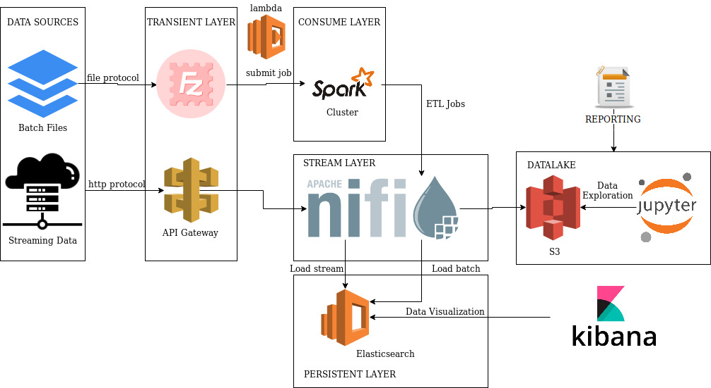

# Data Engineering Test

This project was developed for a skill test at the Data Engineering subject.

## Getting Started

The project objectives is to solve a case with the ingestion of a large amount of data, in batch and streaming format, through an scalable architecture (infra-as-a-code) on AWS cloud.  

Some challenges that the project faces:

Data cleaning;
Data enrichment in batch and streaming;
Data manipulation to add new data to be used in later analysis;
Data visualization in real-time and report-oriented.

Architecture focused in AWS:



To simulate this architecture locally, it was used mainly docker. 

#### Batch use case (ETL - Extract, Transform, Load)
- The archives for ingestion need to be found at '/inbox' folder;
- When starting the project it will simulate a spark job submit to the spark cluster to begin the process;
- After pass by an ETL process, it will be sendes to the '/data/inbox' folder that is monitored by NiFi;
- When the file is received, NiFi starts the process to feed the datalake with treated file ('data/datalake');
- In parallel, NiFi sends the batch to be indexed on ElasticSearch, at data index, doc type; 
- After the process is finished, it can be used both Jupyter, consulting directly the files in datalake using SparkQL to execute the querys emulating Athena and Kibana to explore and visualize the data in a dashboard and export charts and information to the report HTML;  

#### Stream use case
- A post is sended to an API;
- NiFi receives this event in a flowfile format;
- NiFi enrichs the event data with some auxiliar data provided;
- NiFi indexes the event, making it available to data exploration in a real-time dashboard at Kibana.

### Extra use case (ELT - Extract, Load, Transform)
There is another case, where the information needs to be consumed and be available for data analysis and exploration as soon as possible. The methodology for this is an ELT (Extract, Load, Transform). It has an additional risk, because the transformation would be made by a data exploration tool, by hand.
- Files ingestion by S3;
- Files ingestion by a monitoring NiFi process;
- Nifi will convert JSON to Parquet, the way they arrived (raw);
- Transfer the data in S3, at the processed zone;
- Processed zone on S3 can be cataloged with AWS Glue and consumed by AWS Athena;
- Use AWS Athena queries to manipulate the raw data and export the results as CSV.
- It is important to note here that there are a lot of data visualization tools that can be also connect in Athena via JDBC and use it as data source to generate the report needed. But i do not choose this option because the report must be a local HTML file.

### Prerequisites

For the successful replication of this project, some requirements must be installed on your Linux operational system.

For this tutorial, it was used a Debian/Ubuntu distribution: Linux Mint.
If it is another operational system, please follow this tutorial:  

https://runnable.com/docker/install-docker-on-linux

Installing docker
```
sudo apt-get update -y && sudo apt-get install -y linux-image-extra-$(uname -r)
```
```
sudo apt-get install docker-engine -y
```
```
sudo service docker start
```

You will need also to git clone this repository to your local machine with
```
git clone git@github.com:andre250/data-engineering-cases.git
```
## Deployment

After the docker is installed and the repository is clonned, it is necessary download the images of services on the server, they are:

- Standalone Spark Cluster;
- Standalone Nifi Cluster;
- Standalone Elasticsearch Cluster + Standalone Kibana Cluster;

Before start executing our docker-compose please give project access to your user and group

```
sudo chown -R youruser:yourgroup path/to/server/data-engineering-cases
example
sudo chown -R grego:grego home/grego/projects/data-engineering-cases
```

To automate the job, use the docker-compose.yml file at the root folder of the project, it already pull the images and configurate the persistance and the required network objects.

For more info about the docker-compose, check the documented file content.

Move for the folder where is the docker-compose.yml file:
```
cd /path/to/server/data-engineering-cases
```
Execute the server attached to the terminal:
```
docker-compose up
```

Execute the server in background:
```
docker-compose up -d
```

It is importante highlight that some services may take some minutes to initialize.
That's why i create a shell script to check if the systems are online.

Run on terminal. You must be at the root folder of the project.
```
./healthcheck.sh
```

## Services

After the service has completely initialized, you can navigate through US's of the used services.

Nifi UI - http://localhost:8080/nifi
Kibana UI - http://localhost:5601
Elasticsearch Server - http://localhost:4571/_cat/health

## Running

Step-by-step to run the applications:

### Batch Use Case

* Import the files that need to be processed to the folder '/inbox', at the root folder of the project.

* It will be execute the command to simulate a spark job submit to execute a script pyspark at the spark cluster.
```
docker exec -it dataengineeringcases_spark_1 python3 /home/jovyan/work/scripts/startETL.py
```

* After finishing the processing, it will be possible to follow the file receiving and its routing at the NiFi UI: http://localhost:8080/nifi
* After being consumed and archived by NiFi, it will split the records in blocks of 5.000 to avoid overload the Elasticsearch and it will begin the indexing process. Processor name: Batch - Index on Elasticsearch"
* After (or during) the conclusion of all split parts, the user can visualize the "Dashboard Geral", with the dataset information: http://localhost:5601/app/kibana#/dashboard/713493f0-1192-11ea-8ba2-f74df6efb357

PS: It is important to highlight that the ingestion process may take a few minutes, because it depends on the JVM memory, witch was configured to be used at maximum of 512 MB, because i have a low memory machine =). If it exists an interest on making a fine-tunning, it should be changed at the service configuration. (nifi-bootstrap.config)


### Stream Use Case
* The initialization of the server, provides an open REST API only for the post method, at door 8989 of the endpoint: http://localhost:8989/taxiStream.
* To follow in real-time, access the url of the Dashboard: http://localhost:5601/app/kibana#/dashboard/72884a60-1211-11ea-adf4-af3007798d61

PS: This Dashboard is filtering only the current month. For this reason, the POST bellow must have a pickup_datetime referent to the current month. Or the date picker of Kibana must be updated. =)

* The user must make a post at this endpoint
```
curl -d '{"vendor_id":"CMT","pickup_datetime":"2019-11-21T18:51:11.767205+00:00","dropoff_datetime":"2019-11-21T18:57:09.433767+00:00","passenger_count":2,"trip_distance":0.8,"pickup_longitude":-74.004114,"pickup_latitude":40.74295,"rate_code":null,"store_and_fwd_flag":null,"dropoff_longitude":-73.994712,"dropoff_latitude":40.74795,"payment_type":"Cash","fare_amount":5.4,"surcharge":0,"tip_amount":0,"tolls_amount":0,"total_amount":5.4}' -H "Content-Type: application/json" -X POST http://localhost:8989/taxiStream
```

* Follow the data update at the dashboard, with a refresh default of 10 seconds.
### Extra Use Case
* Import the files that need to be processed to the folder '/inbox_elt', at the root folder of the project.

* It will be execute the command to simulate a spark job submit to execute a script pyspark at the spark cluster.
```
docker exec -it dataengineeringcases_spark_1 python3 /home/jovyan/work/scripts/startELT.py
```

* After finishing the processing, it will be possible to follow the file receiving and its routing at the NiFi UI: http://localhost:8080/nifi

* The file was successfully converted to Parquet and now can be accessible via Jupyter Notebook with SparkQL or with AWS Athena.

## Analysis

The analysis results are ate the analysis.html at the root folder of the project.
The spark codes used to manipulate the dataset are at scripts/startETL.py
The numbers, charts and the map was generated by using Kibana.
The HTML storytelling was made by myself! But there are a identical visualizations avaiable at Kibana dashboards. http://localhost:5601/app/kibana#/dashboard/713493f0-1192-11ea-8ba2-f74df6efb357

## Built With

* [Docker](https://www.docker.com/) - Deploy containerized application
* [Apache Nifi](https://nifi.apache.org/) - Data Streaming solution
* [Apache Spark](https://spark.apache.org/) - Distributed programing for bigdata solution
* [Elasticsearch](https://www.elastic.co/pt/) - Index persistance of data
* [Kibana](https://www.elastic.co/pt/products/kibana) - Data visualization tool

## Authors

* **André Petridis** - [Linkedin](https://www.linkedin.com/in/andrepetridis/)
